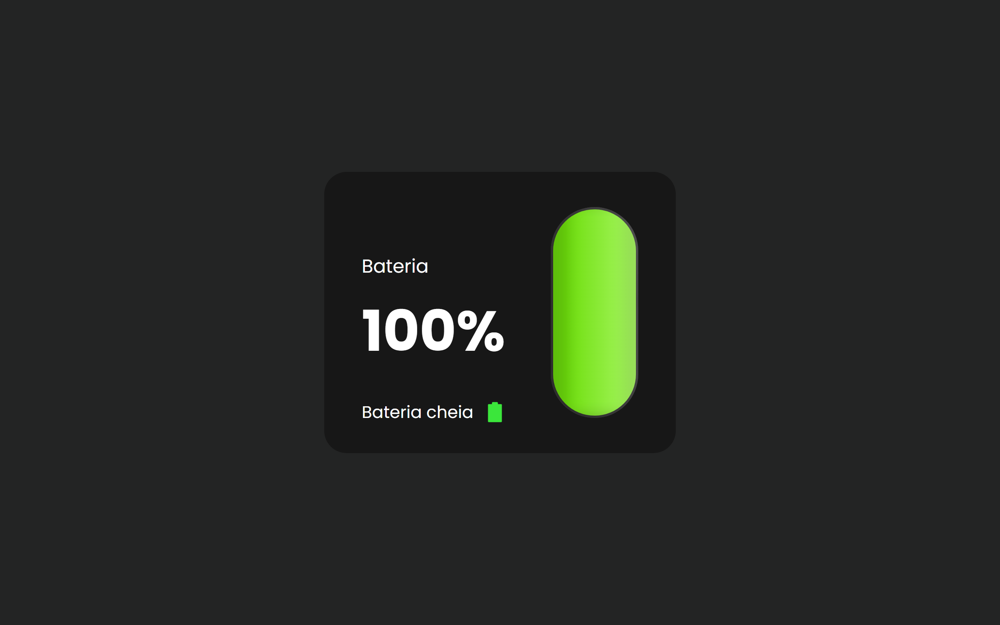

# Battery-level

> Projeto feito com Navigator.getBattery()

🔋 Projeto feito usando HTML, CSS e JavaScript

### 🎉 Sobre
Projeto web que demonstra quando de bateria seu dispositivo possui

> Nota: em aparelhos que não possuem bateria sempre irá indicar 100%

## ✨ Tecnologias

- HTML
- CSS
- Git e Github

## 💡 Ferramentas:
- VS code

---
Made with 💜 by [Luan Fernando](https://www.linkedin.com/in/luan-fernando/).

